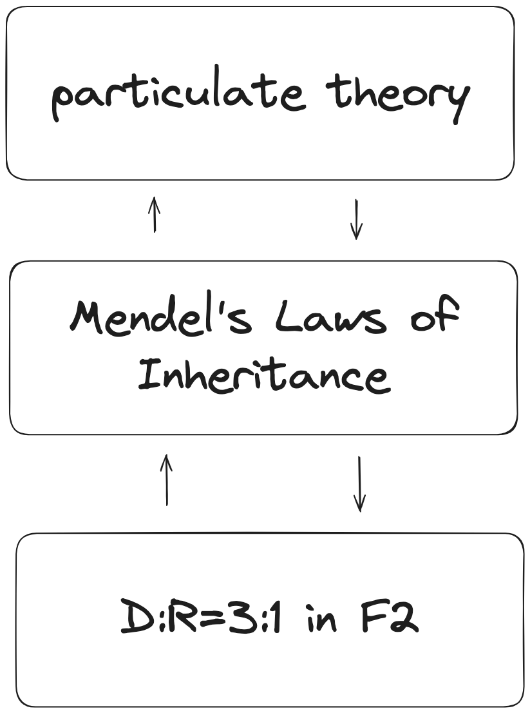
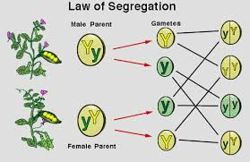
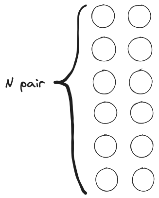

|  |
| :--------------------------------------: |
|       図1 *どのようにメンデルが遺伝子を獲得するに至ったか*       |

|Case| Gene | Phenotype |                           |
|:----:| :----: | :-------: | ------------------------: |
|①| 1    |     1     |                    easy😙 |
|②| 1    |   many    | reality,but too complex ! |
|③| many |     1     | reality,but too complex ! |
|④| many |   many    | reality,but too complex ! |

> [! summary]
> - メンデルの法則は対立形質しか説明していない。
> - この事実はメンデルの法則を、有効範囲の狭いつまらない法則のように見せている。だけど実際には、この事実はメンデルの偉大さを表すものだ。
> - 混合説の矛盾から萌芽した粒子説を理論的に発展させていくと、分離の法則が導出される
> - エンドウが示す対立形質を粒子説で説明しようと試みると、優性・独立の法則が導出(仮定)され、実験デザインが完成する
> - メンデルの法則は、抽象的な遺伝子概念を導入しただけだ。遺伝子の実体は、そののち、モーガン、ワトソン・クリックの発見で実証されていく。
> - メンデルはドルトンの原子説からアイデアを得たのかもしれない。

- エンドウ豆のシワとか、花の色とか、そういう話。(これに付随して、メンデルという名の司教が庭でエンドウを育てた話とか、F1やF2といった言葉が頭に浮かぶかもしれない) 

## メンデルの法則は質的形質しか説明できない

Translate the following Japanese text into English, maintaining the original meaning and tone as accurately as possible, while 

Translate the following Japanese text into English.
You must not significantly change the meaning of the sentences, but it is acceptable to make them sound natural in English. Please ensure the sentences are simple, easy to read, and clear.

メンデルの法則を覚えていますか？学校では、メンデルが行ったエンドウ豆に関する実験を中心に学習します。

ですが、エンドウ豆がしわになるか、花の色が何色になるか、ということに価値を見いだせる人は少ないでしょう。どうして教科書ではメンデルの法則を説明するときに、そんなトリビアルな例を挙げるのでしょうか？もっと重要でハッとさせるものでメンデルの法則を説明してくれたら、私達は楽しめたかもしれません。

これには、メンデルがこの法則を発見するためにエンドウを用いたということも、もちろん関係している。けれど、もっと大きな理由はメンデルの法則それ自体で説明できる事例にあまり面白いものがないということだ[^1]。多分、メンデル以外に見たことがある例と言えば、(TODO: ほかの例 ショウジョウバエやヒトに関して当てはまる例など)

これらの例に共通することはなんだろう。それは1つの遺伝子が1つの形質を決める、ということだ。例えば、エンドウ豆のシワだったら、Aやaといった対立遺伝子があって、AAならシワ、Aaでもシワ、aaではツルン、というふうにAとaの組み合わせだけでシワの有無が決まる。他の遺伝子B,C,D...は関係ない。こういう形質を質的形質という。

一方で、僕たちが興味があるのは複数の遺伝子で決まる形質だ。例えば、ヒトならIQ,身長、牛の脂の付き具合、小麦の重量などなど、みんな複数の遺伝子で決まる。こういう形質を量的形質という。

この2つの用語を使うと、メンデルの法則がボーリングな例しか説明できない理由は「メンデルの法則は質的形質がどのように遺伝するかについての法則であって、量的形質については触れていない」・・・①からだと言える。

じゃあ、どうしてメンデルの法則は教科書に載っていて、皆が学ばなくてはいけないことなのだろう？質的形質という誰も興味が持てないものしか説明できない法則なのに。

Do you remember Mendel's laws?

## メンデルの法則の法則の2通りの味わい方

この疑問に対する答えは2通りある。

1. メンデルの法則は、それ自体が重要な結果、というわけではない。だから、メンデルの法則単体では、あまりおもしろい事実を説明できていなくてもいい。メンデルの法則の本当の価値は、*ある主張*を実証していることにある。
2. メンデルの法則は、組み合わせ数学(nCkとか覚えている？)や統計学(正規分布など基本的なもの)などの数学と組み合わせることで、量的形質を扱うことができる。実際、量的遺伝学という分野では、いくつかの仮定から、非常にエキサイティングな結論、例えば、人類のIQの理論的な限界値が1800で、身長の限界値は5mであることを数学的に導出できたりする。

2.については別のポストで詳しく書いたので、ここでは1.の観点からメンデルの法則を考え、その本当の価値を提示したい。最後まで読めば、①の事実が、メンデルの法則をつまらないものにするどころか、メンデルの偉大さを表していることが理解できると思う。

## 混合説の矛盾から粒子説の萌芽まで

まずは、*ある主張*とは何かについて説明しよう。そのためには、メンデルが生きた時代に一般的だった遺伝に関する考えを説明したほうがいいと思う。

まず遺伝という概念、つまり，親から子供に何かが渡されることで、親と子供が似た特徴(形質)をもつ、ということはメンデルの時代のはるか昔から認識されていた。

そして、メンデルの時代には、遺伝が起きるメカニズムは、父と母それぞれから、形質を決めるどろどろの何か(これが遺伝子ということになる)が提出され、2つが混じり合うことで、子の遺伝子となり、子の形質が決まる、というのが一般常識だった。

つまり、遺伝子というのは、水やヨーグルトのようなもので、父由来と母由来のものが混合されて、子に渡される、という考え方だ。これを混合説という。

[TODO:図 Done blending-model]

この説が正しいなら、

1. カフェオレからコーヒーと牛乳を分離することができないように、一旦父と母の遺伝子が混じり合って、子の遺伝子になれば、子の遺伝子には父や母の遺伝子そのものは残っておらず、子の遺伝子から父の遺伝子を取り出す、というようなこともできない。
2. 白色と赤色を混ぜれば、その中間の色しか生まれないように、子の形質は父と母を両極端にしたときには、その間のものしか生まれない。

ということになる。

けれど、これでは例えば隔世遺伝は説明がつかない。祖父が金髪で、父(祖父の子)と母が茶髪のとき、子供が金髪になりうる、ということを人類は経験的に理解している。しかし、父と母の形質のちょうど中間しか生まれないなら、これはおかしい。子供には祖父が持っていた遺伝子が受け継がれたと考えるのが自然だが、もし混合説が正しいのなら、1.の事実から祖父の遺伝子はもはや残っていないので、子に渡されることはない、ということになる。

もっと重要な事実の説明がつかないことも当時知られていた。ダーウィンの進化論で重要な役割を果たす自然選択だ。メンデルが3法則を発表する少し前、ダーウィンの『種の起源』が発表されている
[^2]。そしてメンデルも、ダーウィンの進化論を知っていたことが知られている。

もし混合説が正しいのなら自然選択の前提となる種内の多様性はどのように保たれるのだろう？子供の形質が親の中間値しか取り得ないなら、世代を経るにつれて集団の分散が小さくなっていくのは明らかだった。ダーウィン自身は混合説に似た考えを持っていたため(TODO:)

以上のように、混合説は隔世遺伝のように日常で見られる事象が説明できないことに加えて、進化論ともうまく噛み合わせることができなかった。

もし、混合説が間違っているのなら、遺伝子はどろどろのものではなく、しっかりした実体をもった小さな粒のようなものであり、それ自体は変化すること無く子供に渡されると考えてみたらどうだろうか？これは粒子説と呼ばれる。

粒子説であれば、隔世遺伝は、祖父の遺伝子が父のなかにも残っていて、子供にそれが渡されたと考えれば説明できそうだ。

しかし、粒子説は進化論が要請するような種の多様性を確保できるのか？遺伝子が変化しなかったら、親と子は全く同じになってしまわないか？直観的にはそう思うかもしれない。ひとまずは、もし粒子説が正しいなら事態はどうなっているはずかを考えていくことにしよう。[^私達は粒子説が正しいと知っているから突き進むことができるけれどメンデルが進むことができたのはどうしてだろう？もしかしたらドルトンの原子説を参考にしたのかもしれない]

## 粒子説をrefineしていこう！

### まずは分離の法則まで

粒子説では、遺伝子はそれ自体が変化しない粒子だ。では、この粒子を生物はいくつ持っているべきだろう？

もし1つだけしか持っていないのなら、(混合説と違って)それが子供に変化しないで引き渡されるので、種の多様性がどう確保されるのか説明が難しくなりそうだ。

実際、この粒はある程度たくさん持っているだろう。いくつ持っていたとしても、子には父と母から同じ個数(N個としよう)ずつ渡されるはず[^もちろん、父からN+1個で母からN-1個のような可能性も考えられるけれど、もっともシンプルなシナリオでは、ということ。以下も同様で、もっともシンプルに事が進むとこうなるはず、というふうに話を進めていく。]だから、子が持つのは2N個になる[^ここでも子供は親から貰ったものを少し捨てて実際には2N-2個しか持っていないかもしれないとかいろいろな可能性が考えられるけどね。あくまでシンプルシナリオ。]。両親は子と同じだけ粒子を持っているはず[^だって、もし子どものほうが数が多いなら世代を経るごとに持っている粒子の数が多くなっていくし、もし子どものほうが数が少ないなら世代を経るといずれ粒子が何もなくなるでしょ。もちろん、これについても再反論はできるよ。考えてみて。]だから、両親も2N個もっていたということだ。であれば、子には自分がもつ半分の粒子を渡したことになる。

[TODO:図 Done 4-parents-child-have-2N-gene]

半分の粒子を渡す、と簡単に言うけれど、例えば2N=10000だとして、10000個のボールが散らかっているような状態で遺伝子が存在しているのなら、どうやって半分の5000個をきっちり子供に渡せば良いのだろう？

[TODO:図 5-many-genes-messy]

この問題を解決するには、2個を1ペアにしてN個のペアを作れば良い。そうして2個1ペアのうち、どちらか1個を子に渡す、ということにしておけば、たくさんの数を数える必要はなくなる。

[TODO:図 6-N-pairs-gene-unpaired]

生物が適応していくことを考えると、このくらい効率の良い方法に長い歴史の中で至ったと考えてもおかしくないだろう。(なんども繰り返すけれど、メンデルの前にダーウィンの進化論はすでに知られていた！)

これで子供に粒子を渡す問題は解決した?まだだ! 

例えば、青色の粒子が花の色を決めるのに関係しているとしよう。そして、この生物はこの粒子を1つだけもっているとする。そうすれば、父と母のどちらかから、きっちり1つだけ、この粒子をもらわなくてはいけない。けれど、次の図のように、子供には一つも受け継がれなかったり、逆に花の色を決める粒子が2つ引き継がれてしまうことがあり得る。この問題は花の色を決める粒子が2つでも3つでも同じように生じる。

[TODO:図 7-N-pairs-gene-unrelated-missing]

これは非常に難しい問題のように見えるけれど、シンプルな解決法がある。それは、2個の粒子が1つのペアとなって働き、花の色を決めるのに関係している、と考えればいいのだ。そうすれば、子供は父と母それぞれからペアの1個をもらえるので、これがまたペアとなることで、子供は必ず花の色を決める2個1ペアを1つだけを持つことになる。

[TODO:図 8-N-pairs-gene-paired]

こう考えると、個体の多様性がどう出てくるのかも理解し始める。前の図で、父・母・子が持っている粒子のペアは異なっている。このようにペアを構成する粒子の組み合わせが個体ごとに違うことで個性が現れているのだろう。

現代的な言葉では、2個1ペアの粒子を遺伝子と呼び、粒子1つずつをアレル(対立遺伝子)と呼ぶ。この言葉を使えば、親がもつ2つのアレルのうち、1つのアレルが子供へ渡されるということになる。これがメンデルの3法則のうち、分離の法則だ。粒子説から何の実験もしないで分離の法則を導くことができてしまった！

### エンドウの対立形質を説明したい！

ここまでの結果は粒子説をもとに進化的に最適と思われる方法を考えることで導かれた。しかし、このままでは机上の空論で、これが正しいことを実験により証明しなければならない。

ここで、エンドウが登場する。 メンデルの実験には先行研究がいくつかあり、エンドウもしばしば取り上げられていたようだ。そこではすでに、

- エンドウが、豆のしわ・スムーズ/ など、コインの裏表のように2つの表現型しかもたない形質(これを質的形質のなかでも対立形質という)をいくつも持っていること
- そしてそれらの形質が隔世遺伝すること

が知られていた(TODO: のかもしれない?)。

エンドウが示す対立形質の振る舞いを、我々の粒子説で説明できるだろうか？もしできるなら、エンドウを使った実験で、我々の理論が証明できるかもしれない！

#### 形質・遺伝子の1対1対応

まず、エンドウがもつこれらの対立形質はいくつの遺伝子に影響を受けるのだろうか？1つの遺伝子で決まるのか？

[TODO:図 9a-1gene-1phenotype]

もしくは複数の遺伝子で決まる対立形質もあるのか？

[TODO:図 9b-many-gene-1phenotype]

あるいは、複数の対立形質に同時に影響を与える遺伝子も存在するかもしれない？
[TODO:図 9c-many-gene-1phenotype]

Maybe... だから、現実はこうかもしれない。
[TODO:図 9d-many-gene-many-phenotype]

しかし、今は現実のすべての側面を見たいわけではない。一般解をいきなり求めようとしても失敗するだけだろう。もっともシンプルな場合には、どうなっているかを考えよう。

そもそも、対立形質のように2つの値しか取らないものを決めるのに、何個も遺伝子を使うのは効率の悪い馬鹿げた方法だ。なぜなら、2つの値を決めるには、1つの遺伝子と2種類のアレルで十分だからだ。
[TODO:図 10-n-gene-m-alleles]

だから、進化がもっとも効率良い方法にたどり着いていれば、2つのアレルだけをもつ1つの遺伝子で形質が決まることになる。もちろん、これはallという意味ではなくsomeという意味で。対立形質をもつ全ての生物が、1gene2alleleという最も効率的な方法で決めているという主張ではなく、ある・いくつかの生物は1gene2alleleで決めていてもおかしくないだろうという推論。たとえば賢いエンドウ君とかがそうしているかもしれないよね。

そうすれば、もっともシンプルな場合には、こうなっているはずだ。(複数の形質に影響を及ぼす遺伝子もないとした)
[TODO:図 9a-1gene-1phenotype]

繰り返すが、遺伝子と形質の関係が*always*こうなっていると主張しているわけではない。In *some* simple situations, これが成り立っている生物がいてもおかしくはないということだ。

- たとえば賢くてミニマリストのエンドウ君とかね！
- そして、エンドウはそのような植物かもしれない！

#### 残り2つの仮定(優性・独立性)

- 僕たちはだいぶ良いところまで来たけれど、実験をデザインするためには、あとさらに2つの仮定が必要になる。そしてそれが、優性の法則と独立の法則だ。
- 僕たちはだいぶ良いところまで来たけれど、実験をデザインするためには、もう少し考えることがある。

まず、1 gene with 2 alleleではAA,Aa,aaで最大3つの表現型を表せてしまう。現実には2つの表現型しか取らないわけだから、余分な情報を圧縮しなければならない。例えばAがしわを表現するアレルで、aがスムーズを表現するアレルとすれば、AA,aaがそれぞれしわ、スムーズなのは確定だ。あとは、Aaが、しわかスムーズのどっちかになっているはずだ。もしAのほうが強ければ、Aaはしわ、aのほうが強ければ、Aaはスムーズ。これって優性の法則だよね！

そして、もう一つ気づきづらい仮定がある。それは、各アレルを子供にわたす際に、どちらのアレルが渡されるかは、遺伝子ごとに独立なのかということ。

例えば、次のような遺伝子をもつ父親がいる。Aが渡される確率とaが渡される確率は？シンプルケースでいくなら、どちらも1/2だろう。ここまではいい。

[TODO:図 11a-father-gene]

では、父親からAの粒子が渡された場合、次のB,bのどちらが渡されるかも1/2なのだろうか？もしくは、Aが選ばれた場合には、Bがより選ばれやすくなるというようなことはあるのだろうか？

[TODO:図 11b-father-gene]

イメージが付きづらければ、トランプの山から次々にカードを引いていくことを考えよう。はじめの1枚が偶数か奇数かの確率は1/2だけど、次からは今までひいたカードが何かに依存して必ずしも1/2ではない。例えば、今まで偶数のカードがたまたまたくさん出てきていれば、次に奇数のカードが出る確率は1/2より大きい！だから奇数にベッドすべきだ！(カウンティングの基本原理 )(TODO: 外部リンクと内部リンクで表示を変える！)

そういう複雑な事態が遺伝子にも生じているのだろうか？現実の答えはまたしても、そういう場合もあれば、そうでない場合もある、ということになる。現代的な言葉を使えば、AaとBbが同じ染色体上にあれば、2つの遺伝子は連鎖するから、1/2ではない。一方で、もし違う染色体上にあれば、独立で1/2になる。(参照: 連鎖。ちなみに、この概念は、メンデルの後継者?モーガンが直面して、一度疑心暗鬼になった後に、メンデル信者と化したエピソードに関連していてとても面白い話だ。)

どちらのケースを採用するか、分かっているよね？今までと同じように、もっともシンプルなケースを考えよう。つまり、各遺伝子の2つのアレルは全て独立に、全てが1/2の確率でどちらかが子供に渡されるのだと。これが独立の法則だ。(これは調べる形質に対応する遺伝子が全て別々の染色体に存在すれば正しい。現在ではメンデルが調べた7つの形質のうち、(TODO:)。これが幸運なのか、メンデルの意図なのか？)

## ようやく実験だ！

ここまでくれば、実験デザインを考えることができる。[TODO: 実際にメンデルが行った実験は？]

メンデルの実験が成功した理由の1つに純系を作成したことが挙げられる。純系とはAA,aaのような遺伝子型をもったもので、これらはAA同士,aa同士で交配させ続けても、常に同じ表現型を示す。

そして遺伝子型AAとaaをもつエンドウ(P)をかけ合わせると、雑種1世代目(F1)の遺伝子型は全てAaとなり、優性の方の性質を示す。そして、F1同士をかけあわせて生まれたF2dの遺伝子型は、AA:Aa:aa = 1:2:1となり、優性と劣勢の性質が3対1で現れる。これは、隔世遺伝のメカニズムを説明するだけでなく、このような整数比でF2に現れることがメンデルの法則の正しさ、ひいては粒子説を証明することになる。

[TODO:図 openstaxの図を使う ]

純系を使わずに単に、優生の性質をもつものと劣勢の性質をもつものたちをかけ合わせても、このような結果は得られない。なぜなら優生のなかにAaが混じっているからだ。

[TODO:図 混ざっている図 F1,F2]

こうなるとF1のいくつかは劣性の形質を示し、F2に整数比は現れない。もちろん、粒子説が誤っているのではなく、優性の法則を考慮しない実験デザインに誤りがあるのだけどね。

純系を作ること無しには、そこから意味を見いだすことのできる秩序を作ることはできない。

どうすれば、純系が作れるだろうか？単に同じ形質を示すものを交配し続ければいい。そうすれば、最初は優性の性質を示すものの中にAaが混じっているだろうが、交配を繰り返していくと、だんだんと集団内でのAaの割合は小さくなっていく。Aaを完全に取り除くことはできないが、仮に100体のうち、99がAAで、1つだけAaである場合、これを100体のaaと交配すると、Aaの割合はX%となり、無視できる量となる。つまり、統計的純系になっているということだ。メンデルの3法則を使えば、最初のAaの割合(これは知ることはできないから仮定する、もっとも多い場合で100%)と、目標とするAaの混在割合をもとに、何回交配すれば、統計的純系を作れるかを数学的に計算できる。[TODO: 実際計算してみてもいいかも]

どうすれば、純系が作れるだろうか？優性の法則から考えれば、劣性の性質を示すものは必ずaaをもっているので純系を作るのは容易だ。AAの純系を作るには、優性の形質を示すものを交配し続ければいい。そうすれば、最初は優性の性質を示すものの中にAaが混じっているだろうが、交配を繰り返していくと、だんだんと集団内でのAaの割合は小さくなっていく。Aaを完全に取り除くことはできないが、仮に100体のうち、99がAAで、1つだけAaである場合、これを100体のaaと交配すると、Aaの割合はX%となり、無視できる量となる。つまり、統計的純系になっているということだ。メンデルの3法則を使えば、最初のAaの割合(これは知ることはできないから仮定する、もっとも多い場合で100%)と、目標とするAaの混在割合をもとに、何回交配すれば、統計的純系を作れるかを数学的に計算できる。[^実はこのプロセスは劣性遺伝病の1つのモデルと見ることもできる。しかしこれでは劣性遺伝病は単調減少することになる。2024年現在これらの病気が単調減少している途中のかpersistしているのかはわからないが、persistする原因には様々なものが挙げられている(劣性遺伝病が蔓延するか？)]

[TODO:図 Aaから純系を作るまでを図示]

このように、メンデルが純系を作ったという事実は、メンデルが実験の前に自分が何を示そうとしているのか、を理解していたことを意味している。

彼は、この実験を行って始めて3法則に気づいたのではなく(例えば、たまたま庭に咲いていたメンデルの花を愛でていたらふと気づいたということではなく)、3法則、そして粒子説を示すためにこの実験を意図したことを示している。

さて、純系を作ることから、最終的にF2においてD:R=3:1となるまで、実験を計画できたので、あとは実験して証明することだ！

こうして解釈し直してみると、前に先走って言ったように、 ①の事実は本当はメンデルの偉大さを表すものだと思う。メンデルはシンプルなケースを意図的に選択したんだ。もし最初から量的形質を考慮に入れた一般論を実験で示そうとしていたらメンデルは失敗していただろう。つまらないほどシンプルなケースだけしか説明できないということはメンデルの偉大な選択の結果なんだ。ガリレオが摩擦のない世界では物体が永久に等速直線運動を続けることを見抜いたように、メンデルは遺伝子1つで形質が決まるという、例外的な状況を使えば、粒子説の正しさを実証することができることを見抜いていたのだと思う。

(Fin)

## いくつかのおまけ
### 独立の法則に関する実験

上で紹介した実験は、メンデルが実際に行った実験の1つであるけれど、1つの形質のみに着目しているものであり、独立の法則は関係していない。独立の法則が関係するのは、さらに別の実験で、異なる2つの形質についての純系(AABBとaabb)を作って、これらをかけ合わせてF1(AaBb)を作り、さらにこれらをかけ合わせて、F2が次の表のようになって、整数比が現れることを示せば良い。これは独立の法則自体の実証にもなるし、粒子説をさらにゆるぎのないものにするだろう。

[TODO: 図 openstaxのものを使う]

メンデルは、異なる3つの形質についても同じ実験(AABBCCとaabbccを作って、F1:AaBbCcを作り、これらをかけ合わせる実験)を行っている。そして、メンデルがこの実験を行うために選んだ2,3の形質は*たまたま*全て別の染色体上にあったことが現在分かっている。もし別の染色体上になければ連鎖が起こって独立の法則は示せなかっただろう。これが*たまたま*なのか、これもメンデルの選択の結果なのだろうか(つまり連鎖が起こらない形質を選び抜いたのか）？

### メンデルの3法則は同等ではない

このように見ていくと、メンデルの3法則は、3つが並立に並べられることが多いけれど、分離の法則は、ほとんど粒子説の帰結で、一般的な法則だ。一方で、優性の法則や独立の法則は最もシンプルな対立形質についてのみ当てはまる話だ。だから、分離の法則は成り立たないことが例外的だけれど、優性の法則や独立の法則は成り立つことが例外的なものだ。もちろん、これがうまいこと成り立っているエンドウを使って粒子説を実証する実験ができたわけだから、この2法則も重要ではあるけれどね。

こういう普遍性の程度の区別は重要だと思う。例えば運動方程式と動摩擦・静止摩擦の法則が同じくらい普遍的だと思っている人を見たら、この人は物理について何も分かっていないと思うでしょ。彼らは運動方程式が成り立たない状況と、動摩擦・静止摩擦の法則が成り立たない状況に対して同じくらい驚くのだろうから。

### メンデルの法則はどこへ繋がるか？

最後に、メンデルの法則はどこへつながっていくんだろう？僕は中学校で、染色体上の遺伝子は減数分裂を経て、子供に引き継がれる、というふうに教わった。これは全く間違っていないけれど、今までの話で分かるように、メンデルが示したもののなかに、染色体とか減数分裂といった実体はない。

メンデルは遺伝子に対応する実体が何なのかは全く示していない。あくまで、不変で個別な遺伝子という概念(粒子説)を使えば、エンドウの実験事実を、うまく説明できるということだ。

じゃあ、遺伝子の実体は何だ？というのが次なる疑問だろう。わたしたちは、どこに遺伝子を持っているのか。

いや、遺伝子には実体がない可能性だってある？例えば、位置エネルギーのように、説明概念としては有効だけれども、私達が触れられるものとしてどこかに実体があるわけではないのかもしれない。

答えはもちろん実体がある！遺伝子は位置エネルギーのような抽象物ではない！それを決定的に示したのがモーガンで、彼は遺伝子が細胞の染色体にあることをつきとめた。そして、そののち、ワトソン・クリックが染色体のなかでもDNAこそが遺伝子の実体であることを示した。

実体があれば操作ができる。こうして我々は自身の遺伝子も改変するようになったんだね。

### メンデルはどこからアイデアを得たのかについての面白い(仮定)話

メンデルは粒子説を無から創造したわけではない。そこにはもちろん先行研究やらはあったのだろう。けれど、粒子説を発展させてアレルの考えを導くのは容易なことではないように思う。

ここで、この時代知られていた、もう一つの最新理論を紹介しよう。それはドルトンの原子説だ。

ドルトンの原子説とは、
- すべての元素は，一定の質量と大きさをもつ原子からなる。
- 原子はそれ以上分割できない粒子で，他の原子に変化しない。
- 原子は新たに生成したり，消滅したりしない。
- 化合物は，異なる種類の原子が，簡単な整数比で結合してできている。
というものだ。

原子の種類は多く、またそれらの組み合わせ数は非常に多いから、多種多様な化合物ができる。生物でも同じように原子に相当する不変のunitがあって、その組み合わせによって多様な個体群が形成されていると考えることができる。

1800年に発表されたこの理論は、メンデルの時代には広く知られていた。(そしてメンデルは大学で)

原子 = 遺伝子、化合物 = 形質とすれば、粒子説とのアナロジーがつけられる。つまり、いくつかの原子が組み合わさって、多種多様な化合物が生じるように、それ自体は不変な遺伝子でも組み合わせによって、生物がもつ色々の形質を生じさせることができるのではないか、ということになる。

この主張が正しいのかはさておき、この時代の最先端の理論である原子説から、メンデルが発想を得たことは、あり得た世界線として記憶に値するように思う。

(TODO: 参考文献)

この遺伝子の実体をめぐる旅は、モーガン、エイブリー、そしてワトソン・クリックへと続き、最終的には、染色体上にあるDNAが遺伝子の実体であることが結論付けられる。こうして

メンデルが提唱したのは、抽象的な遺伝子という単位だった。遺伝子もそういう説明概念なのだろうか？
答えはもちろんノー。最終的には、モーガンが決定的に示したように遺伝子は細胞の染色体にある。つまり、これは私達が、遺伝子というものをmanipulateできる可能性を示唆している。実際、モーガンの発見は現代遺伝学を樹立し、その発見から100年が経とうとする現在では、ヒトの遺伝子治療が行われている。

メンデルは、複雑な現実世界から本質を抽出(TODO:もっとかっこいい言葉を!)した。その本質的な世界だけに集中することで粒子説を実験的に証明できたのだから。メンデルは遺伝子1つで形質が決まるという例外的な状況を使って遺伝の本質を実証したのだ。

まず、優性の法則から純系を作らなければならないことが分かる。

つまり、PとP-をかけあわせたように見えても、実際には別の

そこで、対立形質は1個の遺伝子だけから影響を受ける、つまり、対立形質は1個の遺伝子がもつアレルのペアで決まるとしよう。

とすれば、形質に同時に影響を与える遺伝子が存在するなら、それらの形質は共に発現

1つの遺伝子で決まるのか？複数の遺伝子で決まるのか？もしくはこれらの形質複数に同時に影響を与える遺伝子が存在するか？Maybe... だから、現実はこうかもしれない。しかし、今考えている形質は、例えば実の重量のような連続的な値をとる形質(量的形質)ならではなく、シワ/スムーズのように2つの値しか取らないものなのだ！そんなに複雑なメカニズムが必要だろうか？？もっとも効率的に考えれば、遺伝子は一つで十分で、アレルも2つあれば十分だ。こうすれば、AA,Aa,aaの遺伝子で3つの形質を表せるのだから。

メンデルが独自に見つけだしたショウジョウバエや線虫やIPS細胞のように、時代のモデル生物

- 半分渡すためにはペアにしておくのが効率的、そうすればペアのうち、どちらかを渡すというふうにすれば数を数えなくて良いから。
- ただ、無関係な粒子をペアにしていたのでは、ある形質を決める遺伝子が父からも母からも受け継がれない可能性がでてくる。例えば図ではマメがシワありかスムーズかを決める粒子が子供には一つも受け継がれず、逆に花の色を決める粒子が2つ引き継がれている
- 2個1ペアが一つの遺伝子と考えれば、この問題も解決する。この場合、ペアのどちらを
- こう考えると、個体の多様性がどう出てくるのかも理解できる。つまり、ペアを構成する粒子の組み合わせが個体ごとに違うことで個性が出ているのだろう。
- 現代的な言葉では、ペアを遺伝子と呼び、粒子をアレル(対立遺伝子)と呼ぶので、今後はそう呼ぶことにしよう。
- ここまでは理論的に・思考実験的に・進化的に最適と思われる方法を考えた結果。しかし、何らかの方法で実証しなければならない。
- メンデルの先行研究がいくつかあって、エンドウは先行研究の題材にされることが多かったようだ。そこで、メンデルはエンドウの豆しわ・スムーズ/ のような、2つの形質しかとらず隔世遺伝する、いくつかの形質を知ったのかもしれない。
- これらの2つの値だけをとる形質が粒子説でどのように説明できるか？
- まず、これらの形質は1つの遺伝子で決まるのか？複数の遺伝子で決まるのか？もしくはこれらの形質複数に同時に影響を与える遺伝子が存在するか？Maybe... だから、現実はこうかもしれない。しかし、今考えている形質は、例えば実の重量のような連続的な値をとる形質(量的形質)ならではなく、シワ/スムーズのように2つの値しか取らないものなのだ！そんなに複雑なメカニズムが必要だろうか？？もっとも効率的に考えれば、遺伝子は一つで十分で、アレルも2つあれば十分だ。こうすれば、AA,Aa,aaの遺伝子で3つの形質を表せるのだから。
- しかし、3つと2つは数が合わない。そこでAaは、。これが優性の法則だ。
- そして、今まであまり考えていなかった問題があって、それは、1/2の確率で、父親からAの粒子が渡された場合、次の父親がもつ、B or bのどちらが渡されるか、これも1/2なのだろうか？例えば、トランプの山から次々にカードを引いていく時、はじめの1枚が偶数か奇数かは1/2でいいだろうけど、次からは偶数or奇数は、今までひいたカードが何かに依存して1/2ではない。(カウンティングの基本原理 )(TODO: 外部リンクと内部リンクで表示を変える！)そういう複雑な事態が遺伝子にも生じているのだろうか？現実の答えはそういう場合もあれば、そうでない場合もある、ということになる。しかし、そうなる場合だけを今考えてもいい。一般的な問題を考えないということ。
- 重要なのは、2つのアレルしか持たない1つの遺伝子で決まる形質、それぞれの形質が。全ての場合でそれが成り立つわけではないけれど、粒子説が正しければ、そういう遺伝子・形質群があるはず。特殊例として。そして、この特殊例を使えば、基本的な実験で粒子説を証明できる、というのがメンデルのアイデアだったのではないか？

半分渡せるということは、もともとペアになっていたと考えるのが自然だ。半分を渡せるということは、もともとはペアになっていたと考えるのが自然ではないだろうか？2個同士のN個のペア。でないと、ランダムに半分選んだときに、例えば花の色を決める粒が1つも選ばれないということになってしまうから。(+ きっかり半分渡したいなら、ペアにしておかないと非効率。僕たちの体の中に1個,2個・・・と数えるやつらが存在するのか？進化論で適応していくことを信ずるなら、ペアにするくらいの適応は合ってもいいだろう)

いくつもっているか、ということはわからない。しかし、どんな粒を持っているかによって、そのものの形質が決まるわけで、1ペアの組み合わせでだけで決まる形質もあるだろう。

この1ペアの組み合わせでだけで決まる形質(現代の言葉で言えば質的形質)について注目しよう。

今までの話から、この1ペアの遺伝子Xのうち、1つが父母それぞれから子に渡されることになる。これは分離の法則そのものである。

そして、他の質的形質を決める1ペアの遺伝子Yもあるだろうが、これはYが振り分けられる過程と別 Law of independent assortment

ここで、Aaというペアをもつものがどういう形質を示すのかはわからない。実験してみる必要がある。

しかし遺伝子が親から子へ変わらず受け継がれるなら、多様性は混合説以上に説明がつけづらいものになる。

状況を整理しよう。メンデルが生きた時代、そしてもっともっと前から、遺伝は認識されていた。しかし、その遺伝がおきる

[^1]: (もっと正確には、あまり高度な数学を使わないことには)
[^2]: (僕はこのことを知るまで、メンデルの法則の発見のほうがダーウィンの進化論よりも前のことだろうという思い込んでいた。きっと学校で習う順番がメンデルの法則のほうが先だからだろう。でも)

