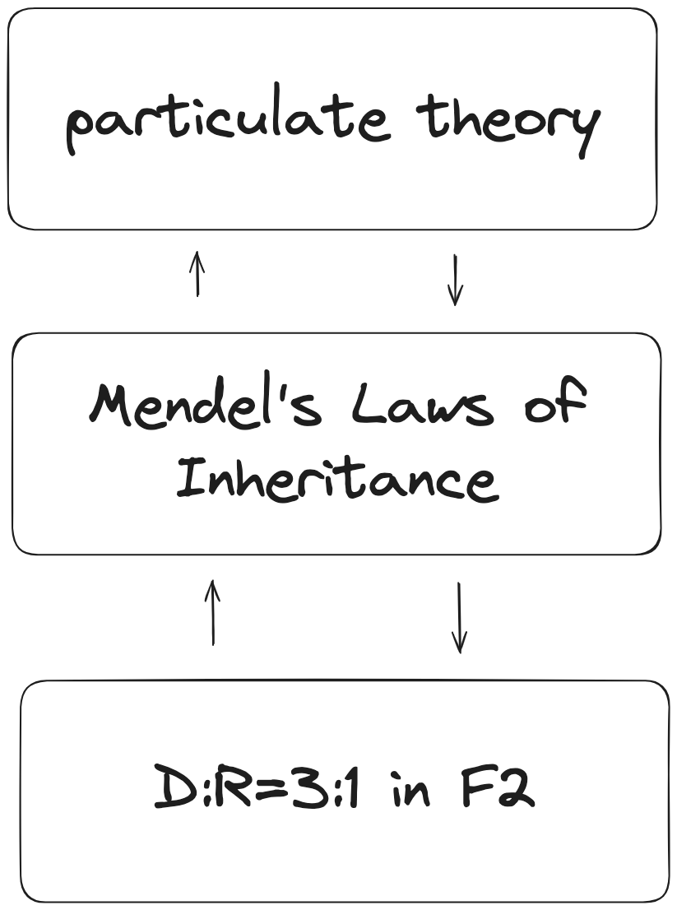
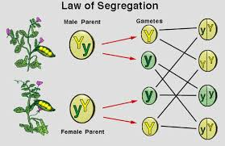
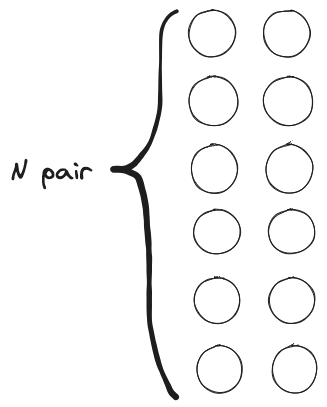

|  |
| :--------------------------------------: |
|       図1 *どのようにメンデルが遺伝子を獲得するに至ったか*       |

|Case| Gene | Phenotype |                           |
|:----:| :----: | :-------: | ------------------------: |
|①| 1    |     1     |                    easy😙 |
|②| 1    |   many    | reality,but too complex ! |
|③| many |     1     | reality,but too complex ! |
|④| many |   many    | reality,but too complex ! |

メンデルの法則って覚えている？

エンドウ豆のシワとか、花の色とか、そういう話。(これに付随して、メンデルという名の司教が庭でエンドウを育てた話とか、F1やF2といった言葉が頭に浮かぶかもしれない)

ひとまずは、どのように遺伝が起きるかを説明する法則だったことを思い出してくれればいい。

でもエンドウ豆のことに、真剣に価値を見いだせる人は少ないと思う。どうして教科書はメンデルの法則を説明するときに、そんなトリビアルな例を挙げるんだろう？もっと重要でハッとさせるようなものでメンデルの法則を説明してくれたら、楽しめるかもしれないのに。。

これには、メンデルがこの法則を発見するためにエンドウを用いたということも、もちろん関係している。けれど、もっと大きな理由はメンデルの法則それ自体で説明できる事例にあまり面白いものがないということだ[^1]。多分、メンデル以外に見たことがある例と言えば、(TODO: ほかの例 ショウジョウバエやヒトに関して当てはまる例など)

これらの例に共通することはなんだろう。それは1つの遺伝子が1つの形質を決める、ということだ。例えば、エンドウ豆のシワだったら、Aやaといった対立遺伝子があって、AAならシワ、Aaでもシワ、aaではツルン、というふうにAとaの組み合わせだけでシワの有無が決まる。他の遺伝子B,C,D...は関係ない。こういう形質を質的形質という。

一方で、僕たちが興味があるのは複数の遺伝子で決まる形質だ。例えば、ヒトならIQ,身長、牛の脂の付き具合、小麦の重量などなど、みんな複数の遺伝子で決まる。こういう形質を量的形質という。

この2つの用語を使うと、メンデルの法則がボーリングな例しか説明できない理由は「メンデルの法則は質的形質がどのように遺伝するかについての法則であって、量的形質については触れていない」・・・①からだと言える。

じゃあ、どうしてメンデルの法則は教科書に載っていて、皆が学ばなくてはいけないことなのだろう？質的形質という誰も興味が持てないものしか説明できない法則なのに。

この疑問に対する答えは2通りある。

1. メンデルの法則は、それ自体が重要な結果、というわけではない。だから、メンデルの法則単体では、あまりおもしろい事実を説明できていなくてもいい。メンデルの法則の本当の価値は、*ある主張*を実証していることにある。
2. メンデルの法則は、組み合わせ数学(nCkとか覚えている？)や統計学(正規分布など基本的なもの)などの数学と組み合わせることで、量的形質を扱うことができる。実際、量的遺伝学という分野では、いくつかの仮定から、非常にエキサイティングな結論、例えば、人類のIQの理論的な限界値が1800で、身長の限界値は5mであることを数学的に導出できたりする。

2.については別のポストで詳しく書いたので、ここでは1.の観点からメンデルの法則を考え、その本当の価値を提示したい。最後まで読めば、①の事実が、メンデルの法則をつまらないものにするどころか、メンデルの偉大さを表していることが理解できると思う。

## メンデルの法則は粒子説から導かれ、粒子説を実証する

まずは、*ある主張*とは何かについて説明しよう。そのためには、メンデルが生きた時代に一般的だった遺伝に関する考えを説明したほうがいいと思う。

まず遺伝という概念、つまり，親から子供に何かが渡されることで、親と子供が似た特徴(形質)をもつ、ということはメンデルの時代のはるか昔から認識されていた。

そして、メンデルの時代には、遺伝が起きるメカニズムは、父と母それぞれから、形質を決めるどろどろの何か(これが遺伝子ということになる)が提出され、2つが混じり合うことで、子の遺伝子となり、子の形質が決まる、というのが一般常識だった。

つまり、遺伝子というのは、水やヨーグルトのようなもので、父由来と母由来のものが混合されて、子に渡される、という考え方だ。これを混合説という。

この説が正しいなら、

1. カフェオレからコーヒーと牛乳を分離することができないように、一旦父と母の遺伝子が混じり合って、子の遺伝子になれば、子の遺伝子には父や母の遺伝子そのものは残っておらず、子の遺伝子から父の遺伝子を取り出す、というようなこともできない。
2. 白色と赤色を混ぜれば、その中間の色しか生まれないように、子の形質は父と母を両極端にしたときには、その間のものしか生まれない。

ということになる。

けれど、これでは例えば隔世遺伝は説明がつかない。祖父が金髪で、父(祖父の子)と母が茶髪のとき、子供が金髪になりうる、ということを人類は経験的に理解している。しかし、父と母の形質のちょうど中間しか生まれないなら、これはおかしい。子供には祖父が持っていた遺伝子が受け継がれたと考えるのが自然だが、もし混合説が正しいのなら、1.の事実から祖父の遺伝子はもはや残っていないので、子に渡されることはない、ということになる。

もっと重要な事実の説明がつかないことも当時知られていた。ダーウィンの進化論で重要な役割を果たす自然選択だ。メンデルが3法則を発表する少し前、ダーウィンの『種の起源』が発表されている
[^2]。そしてメンデルも、ダーウィンの進化論を知っていたことが知られている。

もし混合説が正しいのなら自然選択の前提となる種内の多様性はどのように保たれるのだろう？子供の形質が親の中間値しか取り得ないなら、世代を経るにつれて集団の分散が小さくなっていくのは明らかだった。ダーウィン自身は混合説に似た考えを持っていたため(TODO:)

以上のように、混合説は隔世遺伝のように日常で見られる事象が説明できないことに加えて、進化論ともうまく噛み合わせることができなかった。

隔世遺伝を説明するためには、祖父の遺伝子が父のなかにも残っていて、子供にそれが渡されたと考えるのが自然だ。そこで、遺伝子はどろどろのものではなく、しっかりした実体をもった小さな粒のようなものであり、それ自体は変化すること無く子供に渡されると考えてみよう。これは粒子説と呼ばれる。

この粒はいくつ持っているべきだろうか？もし1つなら、子供にそれがそのまま渡されることになるので、クローン人間になる(両親から1つずつ渡されて子供と親の個数が合わなくなるのも問題だ)。実際、この粒はある程度たくさん持っているだろう。いくつであっても、子には父と母から同じ個数(N個としよう)ずつ渡されるはずだから、子が持つのは2N個になる。子は両親と同じだけ粒を持っているはずだから、両親も2N個もっていて、子には、その半分を渡したことになる。

半分を渡す、と簡単に言ったが、

- 半分渡すためにはペアにしておくのが効率的、そうすればペアのうち、どちらかを渡すというふうにすれば数を数えなくて良いから。
- ただ、無関係な粒子をペアにしていたのでは、ある形質を決める遺伝子が父からも母からも受け継がれない可能性がでてくる。例えば図ではマメがシワありかスムーズかを決める粒子が子供には一つも受け継がれず、逆に花の色を決める粒子が2つ引き継がれている
- 2個1ペアが一つの遺伝子と考えれば、この問題も解決する。この場合、ペアのどちらを
- こう考えると、個体の多様性がどう出てくるのかも理解できる。つまり、ペアを構成する粒子の組み合わせが個体ごとに違うことで個性が出ているのだろう。
- 現代的な言葉では、ペアを遺伝子と呼び、粒子をアレル(対立遺伝子)と呼ぶので、今後はそう呼ぶことにしよう。
- ここまでは理論的に・思考実験的に・進化的に最適と思われる方法を考えた結果。しかし、何らかの方法で実証しなければならない。
- メンデルの先行研究がいくつかあって、エンドウは先行研究の題材にされることが多かったようだ。そこで、メンデルはエンドウの豆しわ・スムーズ/ のような、2つの形質しかとらず隔世遺伝する、いくつかの形質を知ったのかもしれない。
- これらの2つの値だけをとる形質が粒子説でどのように説明できるか？
- まず、これらの形質は1つの遺伝子で決まるのか？複数の遺伝子で決まるのか？もしくはこれらの形質複数に同時に影響を与える遺伝子が存在するか？Maybe... だから、現実はこうかもしれない。しかし、今考えている形質は、例えば実の重量のような連続的な値をとる形質(量的形質)ならではなく、シワ/スムーズのように2つの値しか取らないものなのだ！そんなに複雑なメカニズムが必要だろうか？？もっとも効率的に考えれば、遺伝子は一つで十分で、アレルも2つあれば十分だ。こうすれば、AA,Aa,aaの遺伝子で3つの形質を表せるのだから。
- しかし、3つと2つは数が合わない。そこでAaは、。これが優性の法則だ。
- そして、今まであまり考えていなかった問題があって、それは、1/2の確率で、父親からAの粒子が渡された場合、次の父親がもつ、B or bのどちらが渡されるか、これも1/2なのだろうか？例えば、トランプの山から次々にカードを引いていく時、はじめの1枚が偶数か奇数かは1/2でいいだろうけど、次からは偶数or奇数は、今までひいたカードが何かに依存して1/2ではない。(カウンティングの基本原理 )(TODO: 外部リンクと内部リンクで表示を変える！)そういう複雑な事態が遺伝子にも生じているのだろうか？現実の答えはそういう場合もあれば、そうでない場合もある、ということになる。しかし、そうなる場合だけを今考えてもいい。一般的な問題を考えないということ。
- 重要なのは、2つのアレルしか持たない1つの遺伝子で決まる形質、それぞれの形質が。全ての場合でそれが成り立つわけではないけれど、粒子説が正しければ、そういう遺伝子・形質群があるはず。特殊例として。そして、この特殊例を使えば、基本的な実験で粒子説を証明できる、というのがメンデルのアイデアだったのではないか？
- 

半分渡せるということは、もともとペアになっていたと考えるのが自然だ。半分を渡せるということは、もともとはペアになっていたと考えるのが自然ではないだろうか？2個同士のN個のペア。でないと、ランダムに半分選んだときに、例えば花の色を決める粒が1つも選ばれないということになってしまうから。(+ きっかり半分渡したいなら、ペアにしておかないと非効率。僕たちの体の中に1個,2個・・・と数えるやつらが存在するのか？進化論で適応していくことを信ずるなら、ペアにするくらいの適応は合ってもいいだろう)

いくつもっているか、ということはわからない。しかし、どんな粒を持っているかによって、そのものの形質が決まるわけで、1ペアの組み合わせでだけで決まる形質もあるだろう。

この1ペアの組み合わせでだけで決まる形質(現代の言葉で言えば質的形質)について注目しよう。

今までの話から、この1ペアの遺伝子Xのうち、1つが父母それぞれから子に渡されることになる。これは分離の法則そのものである。

そして、他の質的形質を決める1ペアの遺伝子Yもあるだろうが、これはYが振り分けられる過程と別 Law of independent assortment

ここで、Aaというペアをもつものがどういう形質を示すのかはわからない。実験してみる必要がある。

しかし遺伝子が親から子へ変わらず受け継がれるなら、多様性は混合説以上に説明がつけづらいものになる。

ここで、この時代知られていた、もう一つの最新理論を紹介しよう。それはドルトンの原子説だ。

ドルトンの原子説とは、
- すべての元素は，一定の質量と大きさをもつ原子からなる。
- 原子はそれ以上分割できない粒子で，他の原子に変化しない。
- 原子は新たに生成したり，消滅したりしない。
- 化合物は，異なる種類の原子が，簡単な整数比で結合してできている。
というものだ。

1800年に発表されたこの理論は、メンデルの時代には広く知られていた。(そしてメンデルは大学で)

原子 = 遺伝子、化合物 = 形質とすれば、粒子説とのアナロジーがつけられる。つまり、いくつかの原子が組み合わさって、多種多様な化合物が生じるように、それ自体は不変な遺伝子でも組み合わせによって、生物がもつ色々の形質を生じさせることができるのではないか、ということになる。

この主張が正しいのかはさておき、この時代の最先端の理論である原子説から、メンデルが発想を得たことは、あり得た世界線として記憶に値するように思う。

状況を整理しよう。メンデルが生きた時代、そしてもっともっと前から、遺伝は認識されていた。しかし、その遺伝がおきる

こうして解釈し直してみると、前に先走って言ったように、 ①の事実こそが、メンデルの偉大さを表しているとも言える。それは、ガリレオが摩擦のない世界では物体が永久に等速直線運動を続けることを示したことと良く似ている。メンデルは、複雑な現実世界から本質を抽出(TODO:もっとかっこいい言葉を!)したのだ。

つまり、に、メンデルは遺伝子1つで形質が決まるという例外的な状況を使って遺伝の本質を実証したのだ。

[^1]: (もっと正確には、あまり高度な数学を使わないことには)
[^2]: (僕はこのことを知るまで、メンデルの法則の発見のほうがダーウィンの進化論よりも前のことだろうという思い込んでいた。きっと学校で習う順番がメンデルの法則のほうが先だからだろう。でも)

